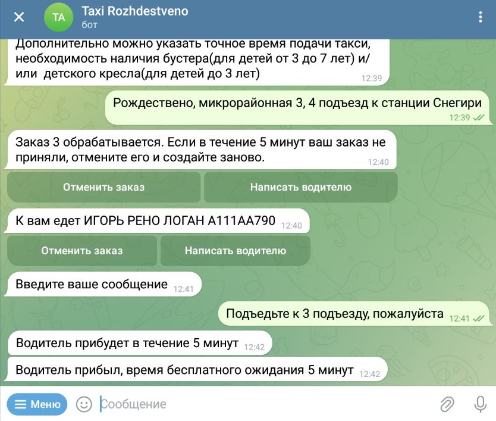

Привет, я <a href="https://github.com/TY95MC" target="_blank">Игорь</a>. Это мой проект Taxi-telegram-bot.
***

#### История создания проекта и решаемая им проблема

Работая в поселковой службе такси, столкнулся с проблемой следующего характера:
клиенты начали жаловаться, что невозможно дозвониться диспетчеру либо диспетчер утверждает, что свободных машин нет, а
на самом деле таксисты в это время стоят в ожидании заказа.

Мессенджер Telegram является широко распространенным приложением и предоставляет возможности создания ботов различного
назначения и широкого функционала. Эти факторы, а также отсутствие затрат на создание собственного мобильного приложения
и, как следствие, короткие сроки разработки, стали ключевыми при принятии решения о выборе телеграм-бота как оптимальное
решение сложившейся проблемы.

Телеграм-бот служит дополнением диспетчера, но не его полной заменой. 
Для удобства работы с ботом все id сотрудников, клиентов, заказов и гос. номера автомобилей выполнены
моноширинным шрифтом, что позволяет мгновенно копировать их одним касанием и далее использовать в тех или иных командах.

Проект написан с учетом некоторых особенностей:

1. цены в таксопарке фиксированные;
2. на смене только один диспетчер;
3. количество автомобилей в таксопарке менее 20;
4. население обслуживаемого и прилегающих поселков в совокупности чуть менее 14000 человек;

Проект задуман как open-source. При его использовании целиком или адаптации 
под собственные нужды указать активную ссылку на этот репозиторий.

***

#### Стек технологий

spring-boot, telegrambots, apache-poi, hibernate, lombok, docker-compose, postgresql, maven

***

#### Запуск приложения

* Сборка проекта
    * mvn clean
    * mvn package
* Запуск docker-compose.yml
    * войти в директорию, содержащую файл docker-compose.yml
    * выполнить команду docker-compose up --build

***

#### Сущности проекта

* Клиент
* Заказ
* Сотрудники
    * администратор
    * диспетчер
    * водитель
* Автомобиль
* Отзыв
* Утерянная вещь

***

#### Основные возможности бота

* Заказ такси
    * Чат клиента. Оформление заказа   
      
      
    * Чат водителя. Принятие заказа   
      
    * Чат диспетчера. Уведомления о принятии заказа   
      
    * Чат клиента. Уведомление о принятии заказа   
      

    * На случай каких-либо форс-мажоров реализована функция связи с водителем
        * Чат клиента   
             
          
        * Отображение сообщения у водителя   
             
          

    * Уведомление клиента о скором прибытии такси   
      

    * На случай спама заказов от пользователя либо отказе оплаты поездки, предусмотрена функция приостановки доступа
      клиента к сервису с различным временным отрезком   
      

* Добавление\удаление сотрудников администратором   
     
  

* Получение администратором excel-отчета об отзывах клиентов    
  

***

